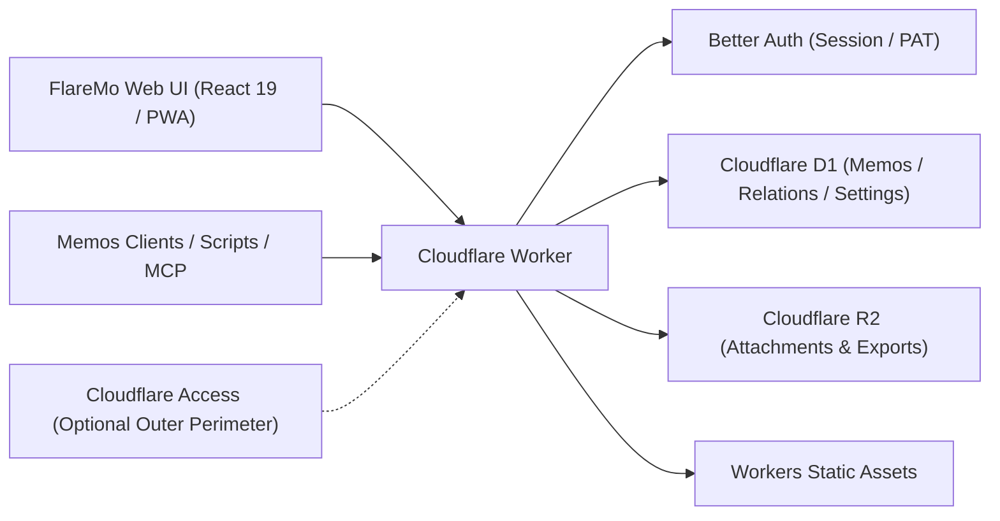

# FlareMo 🔥

<p align="center">
  <b>Zero Servers · Zero Upkeep · 24/7 Global Edge Uptime · Absolute Data Ownership</b><br>
  For individuals: a quiet, focused thought capture space and second brain. For teams: a shared knowledge base with fine-grained roles.
</p>

<p align="center">
  <a href="./README.md"><b>English</b></a> •
  <a href="./README.zh-CN.md">简体中文</a> •
  <a href="./README.ja.md">日本語</a> •
  <a href="./README.fr.md">Français</a> •
  <a href="./README.es.md">Español</a> •
  <a href="./README.ko.md">한국어</a> •
  <a href="./README.ru.md">Русский</a> •
  <a href="./README.ar.md">العربية</a>
</p>

<p align="center">
  <a href="https://github.com/realchendahuang/FlareMo/stargazers"></a>
  <a href="./LICENSE"></a>
  <a href="https://workers.cloudflare.com/"></a>
  <a href="https://github.com/usememos/memos"></a>
  <a href="https://www.better-auth.com/"></a>
  <a href="https://flaremo.app"></a>
</p>

<div align="center">

| ☀️ Desktop · Light Theme | 🌙 Desktop · Dark Theme | 📱 Mobile · Responsive |
| :---: | :---: | :---: |
|  |  |  |

<sub>Actual live screenshots: seamless light/dark mode switching and full-featured mobile responsiveness. Every feature shown is wired to working backend capabilities.</sub>

</div>

---

## 💡 Why FlareMo?

Tools like Flomo and Memos proved the immense value of low-friction memo capture and a distraction-free timeline. However, self-hosting a traditional note-taking setup typically means paying for a VPS, configuring Docker and PostgreSQL, scripting automated backups, and dreading disk or hardware failures.

FlareMo answers a simpler question: **Can you get a 24/7 online, resilient, globally accelerated knowledge base with zero server maintenance, using just a free Cloudflare account?**

- **Truly Serverless**: Both code and static assets run on Cloudflare Workers edge nodes near you with millisecond latency.
- **Enterprise-grade durability out of the box**: Cloudflare D1 handles notes and metadata; Cloudflare R2 stores media attachments with multi-region replication.
- **AI-Native Second Brain**: Built-in MCP endpoints and Agent Memory hub allow AI agents (Claude, Cursor, Codex, ChatGPT) to read and update your long-term preferences and project context.
- **Quiet for one, powerful for many**: Default is an encrypted, private single-user sanctuary. Enable team mode, and it instantly transforms into a collaborative workspace with roles and three-tier visibility.

---

## ✨ Key Features

### 1. Instant Capture & Inspiring Review
- **Capture in milliseconds**: Card-style timeline, tags, Markdown/GFM, and previews for image and audio attachments.
- **Lightning-fast search**: SQLite FTS5 full-text indexing with query operators (`has:attachment`, `is:pinned`, `before:YYYY-MM-DD`, `after:YYYY-MM-DD`, `in:timeline|archive|trash`).
- **Semantic "Find" (Vector Search)**: Workers AI embeddings paired with Vectorize derived vector indexes for contextual recall; re-verifies permissions against D1 and seamlessly falls back to FTS5.
- **Thought activation**: Built-in **Daily Review** (on this day), **Random Walk** (wandering through tag and backlink graphs with postcard summaries), and related note recommendations.
- **Revision history**: Full version diffs and one-click historical restore.

### 2. AI Long-term Memory & Native MCP
- **Agent Memory**: Through `/memory/mcp`, AI agents can record and update cross-session long-term memory (preferences, project decisions, constraints, lessons).
- **Human in the loop**: Review, verify, lock, or correct AI-recorded memories at `/memory`.
- **Open ecosystem**: Standard `/mcp` (Streamable HTTP MCP) endpoint to query and append notes programmatically.

### 3. Team Collaboration & 3-Tier Visibility
- **Role governance**: `owner`, `admin`, and `member` roles. Admins invite members via one-time activation links (members choose their own passwords; admins never handle plaintext credentials).
- **3-tier visibility**:
  - 🔒 **Private**: Only author can view.
  - 👥 **Team**: Shared read-only with active team members.
  - 🌐 **Public**: Anonymous read-only via time-limited share links.
- **Safe offboarding**: Removing a member triggers reliable background cleanup that purges private data while preserving team and public notes.

### 4. Offline First & PWA Experience
- **Installable PWA**: Install to macOS, Windows, iOS, or Android home screen with native feel.
- **Reliable offline sync**: Drafts save locally instantly. Offline submissions and uploads queue up and replay automatically when connectivity is restored.
- **Live voice capture**: Access `/capture` for real-time streaming speech-to-text (ASR) transcription.

### 5. Secure Better Auth Application Security
- **Better Auth powered**: HttpOnly, `SameSite=Lax` browser cookie sessions; revocable `memos_pat_` Personal Access Tokens for scripts, CLI, and MCP.
- **Strict Origin protection**: State-changing requests enforce exact origin whitelisting. Cloudflare Access remains available as an optional outer defensive perimeter.

### 6. Memos Compatibility & Seamless Migration
- **Memos `/api/v1` compatibility**: Provides core Memos API endpoints (camelCase default, legacy snake_case via header) and OpenAPI schema.
- **Third-party apps ready**: Works directly with mobile clients like Moe Memos.
- **Bi-directional import & export**: One-click import from Memos / flomo with conflict strategies and full raw export bundles.

---

## 📊 How Generous Is Cloudflare's Free Tier?

Many assume "free" means "severely limited". For text-heavy personal knowledge bases, Cloudflare's free quota is virtually inexhaustible:

| Resource | Free Tier Quota | Equivalent Capacity | Practical Lifespan |
| :--- | :--- | :--- | :--- |
| **Cloudflare D1** | **5 GB database** | ~**2.5 Million** text memos | Writing 100 memos daily would take **68 years** to fill |
| **Cloudflare R2** | **10 GB storage** | ~**5,000–10,000** photos / **80 hours** of voice | **$0 egress fees**; public sharing won't trigger bandwidth bills |
| **Cloudflare Workers** | Generous free request limits | 300+ global edge locations | Millisecond latency worldwide without cold boots |

---

## 🥊 Comparison: Cloudflare Native vs Home NAS vs Traditional VPS

| Dimension | Cloudflare Native (FlareMo) | Home NAS / Mini PC | Traditional VPS |
| :--- | :--- | :--- | :--- |
| **Data Durability** | **Enterprise multi-region replication**, zero hardware failure risk | Single drive failure or power outage can cause total data loss | Dependent on manual snapshot & backup routines |
| **Maintenance** | **Zero**: No OS patching, no Docker compose, no DB maintenance | OS updates, Docker upkeep, SMART disk alerts, router configs | Kernel upgrades, security patches, watchdog daemons |
| **Access Latency** | **Global edge CDN**, sub-100ms response anywhere | Requires DDNS / frp / Tailscale tunnels, constrained by home uplink | Dependent on single cloud region; high cross-border latency |
| **SSL & Domains** | **Automated HTTPS** & custom domain bindings | Manual certificate issuance, reverse proxy configuration | Nginx / Caddy config & Let's Encrypt renewal maintenance |
| **Financial Cost** | **$0 / month** on free tier | High upfront hardware cost + ongoing electricity | Ongoing monthly / annual server & bandwidth bills |

---

## 🚀 5-Minute Quick Deployment

### Method 1: Deploy with an AI Agent (Recommended)

Give the repository to an agent capable of executing terminal commands (e.g. Claude Code, Cursor Agent, Codex) along with [docs/agent-deploy.md](./docs/agent-deploy.md):
> "Please deploy FlareMo to my Cloudflare account following docs/agent-deploy.md."

---

### Method 2: GitHub Action (self-hosted fork)

On your fork, run **Deploy to Cloudflare** from Actions. Full steps: [GitHub Action deploy](./docs/en/github-action-deploy.md).

---

### Method 3: Manual 3-Step Deployment

#### 1. Create Cloudflare Resources
```bash
pnpm exec wrangler whoami
pnpm exec wrangler d1 create flaremo
pnpm exec wrangler r2 bucket create flaremo-attachments
```

#### 2. Configure Settings & Secrets
```bash
cp wrangler.jsonc.example wrangler.jsonc
```
Fill in the generated `database_id` and set `FLAREMO_PUBLIC_URL` to your production domain. Then set secrets:
```bash
pnpm exec wrangler secret put BETTER_AUTH_SECRET --config ./wrangler.jsonc
pnpm exec wrangler secret put FLAREMO_BOOTSTRAP_SECRET --config ./wrangler.jsonc
```

#### 3. Deploy
```bash
pnpm verify
pnpm deploy:dry-run
pnpm deploy
```
Visit your production domain at `/setup` and enter the `FLAREMO_BOOTSTRAP_SECRET` to initialize your Owner account.

Detailed guides: [Deployment Guide](./docs/en/deploy.md) · [GitHub Action deploy](./docs/en/github-action-deploy.md) · [Update Guide](./docs/en/update.md).

---

## 🧱 Architecture & Tech Stack



- **Runtime**: Cloudflare Workers
- **Frontend**: React 19, Vite, TanStack Router, Tailwind CSS 4, Radix UI
- **Database**: Cloudflare D1, Drizzle ORM
- **Storage**: Cloudflare R2
- **Auth**: Better Auth (HttpOnly cookie session + revocable `memos_pat_`)
- **AI & Search**: Workers AI, Vectorize, SQLite FTS5

---

## 🌟 Star History

[](https://star-history.com/#realchendahuang/FlareMo&Date)

---

## 📄 License

Open-sourced under the [GNU AGPL-3.0](./LICENSE) license.
Copyright (c) 2026 realchendahuang.
