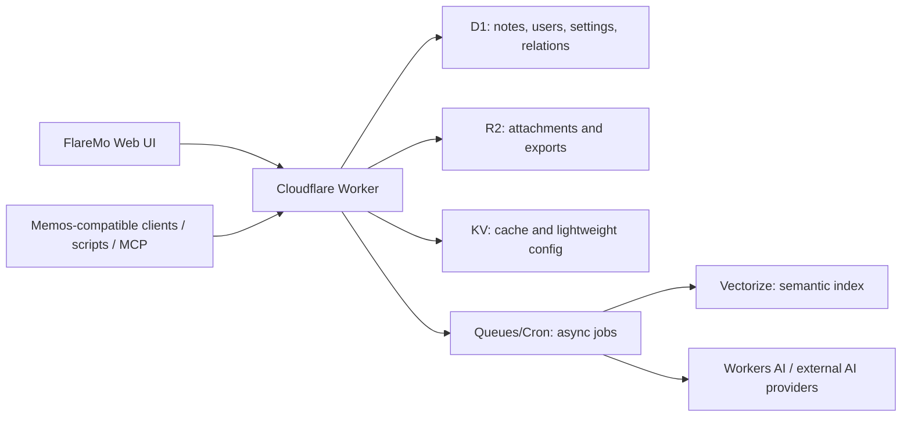

# FlareMo

**Cloudflare 原生 · Memos 兼容 · 个人知识管理平台**

A Memos-compatible, Cloudflare-native personal knowledge management system.

---

## 初心

我一直在找一个"随手记下、慢慢长成知识"的工具。

- 想要 Flomo 那种**开箱即记、不打扰的灵感收集**体验;
- 想要 Memos 那种**成熟的开源生态、数据可迁移、API 可玩**;
- 又不想再自建一台 VPS、维护 Docker、Postgres、Node 常驻进程。

于是有了 FlareMo —— 把 Memos 的数据模型与公共协议当成"规范",把整套运行时**重新搭在 Cloudflare 上**:Workers 跑 API、D1 存笔记、R2 放附件、Queues/Cron 跑后台、Vectorize + Workers AI 做语义检索与 AI 工作流。

一句话:**站在 Memos 的肩膀上,做一份真正属于边缘云的个人知识库。**

**The idea:** keep the quick-capture spirit of Flomo, reuse the Memos
ecosystem as much as possible, and make the whole stack deployable on
Cloudflare — no long-running VM, Docker, Postgres, or Node server as a
core production dependency.

## 定位

FlareMo 不是一个通用的"再来一个笔记 App",目标是分阶段演进:

| 阶段 | 定位 | 关键能力 |
| --- | --- | --- |
| **v1** | Flomo 风格的极速收集 + Memos 兼容笔记系统 | 快速记录、时间线、搜索、标签、导入导出、Memos `/api/v1` 子集 |
| **v1.5** | 个人知识库雏形 | R2 附件、链接预览、向量索引、语义搜索 |
| **v2** | 真正的个人知识管理平台 | 问我的笔记、每日/每周回顾、相关笔记、附件抽取、AI 标签建议 |

核心约束从一开始就定死:**全部跑在 Cloudflare 上**。Workers 边缘运行时是一个请求一次执行的世界,我们刻意不引入常驻进程、文件系统、本地 SQLite 驱动这些"传统后端"假设。这意味着架构要重写,但换来的是全球低延迟、零运维、按量计费、与 Cloudflare AI/向量/队列原语天然打通。

**Positioning:** a staged personal knowledge platform — start as a
Flomo-style capture + Memos-compatible note system on Cloudflare, then
grow into semantic search and AI-driven knowledge workflows, while
staying fully Cloudflare-native every step of the way.

## FlareMo 是什么

围绕三件事设计:

1. **Memos 兼容优先**
   - 沿用 Memos 的领域模型:memos、users、attachments、relations、
     shares、settings、tags,以及从笔记计算出来的 payload/property。
   - 沿用 Memos 的资源命名,如 `memos/{id}`、`users/{id}`、
     `attachments/{id}`。
   - 高价值 `/api/v1` 兼容层,服务于 Memos 客户端、脚本、导入导出、
     OpenAPI、MCP。

2. **Cloudflare 原生运行时**
   - Workers 跑 API 与边缘运行时。
   - D1 存关系型数据。
   - R2 存附件、导出包、生成物、音频。
   - Queues / Cron 跑后台任务。
   - Vectorize + Workers AI 承载未来的语义检索与 AI 工作流。

3. **Flomo 风格的产品体验**
   - 收集为先的写作流。
   - 安静、可快速扫读的时间线。
   - 快速搜索、标签、反链、每日回顾。
   - 轻量个人知识管理,而不是沉重的后台系统。

## 为什么是 Memos + Cloudflare

在这个赛道里,Memos 拥有最成熟的开源生态:成型的数据模型、明确的
API 方向、OpenAPI 工作、导入导出价值,以及一大群活跃用户。

Cloudflare 又恰好提供了轻量个人知识系统所需的原语:全球 Workers、
D1 的无服务器 SQLite、R2 的对象存储,以及边缘上的 AI 积木。

FlareMo 把两者接起来:

**Memos 生态兼容 + Cloudflare 原生部署 + Flomo 风格收集体验**

## 与 Memos 的关系

FlareMo 并不打算把原版 Go 写的 Memos 服务原样搬到 Cloudflare。那个
服务依赖传统常驻运行时:`http.Server`、Echo、`database/sql`、
SQLite/Postgres/MySQL 驱动、本地文件服务、SSE 连接管理、后台
runner。

FlareMo 把 Memos 作为**主规范与生态锚点**,然后在 Cloudflare 上重建
运行时:

- 在关键路径上保留兼容的数据形状与公共协议。
- 在 D1 与 R2 上重新实现存储。
- 保留 Memos 兼容的 `/api/v1` 面,以便复用生态。
- 只在前端需要更"边缘友好"的形态时,才加 FlareMo 原生 API。

## 兼容性规划

第一 compat 目标是一个**实用的 Memos 子集**,并非首日全量对齐。

### 数据兼容

- Memos 风格的 memo/user/attachment/relation/share/settings 表。
- 兼容的资源命名。
- 兼容的 memo payload/property 形状,覆盖 tags、title、links、
  tasks、code、location。
- Memos 导入导出路径。

### API 兼容

计划优先实现的高价值端点:

- `POST /api/v1/memos`
- `GET /api/v1/memos`
- `GET /api/v1/{name=memos/*}`
- `PATCH /api/v1/{memo.name=memos/*}`
- `DELETE /api/v1/{name=memos/*}`
- `GET /api/v1/{name=memos/*}/attachments`
- `PATCH /api/v1/{name=memos/*}/attachments`
- `GET /api/v1/{name=memos/*}/relations`
- `PATCH /api/v1/{name=memos/*}/relations`
- `POST /api/v1/{parent=memos/*}/shares`
- `GET /api/v1/shares/{share_id}`
- `POST /api/v1/attachments`
- `GET /api/v1/attachments`
- `GET /api/v1/{name=attachments/*}`
- `DELETE /api/v1/{name=attachments/*}`

### 生态兼容

- 为脚本与工具支持 Bearer token / 个人访问令牌。
- 为所支持的 `/api/v1` 子集维护 OpenAPI 文档。
- 基于或对齐该 OpenAPI 生成 MCP 端点。

## 架构

## 路线图

- [ ] Cloudflare Worker + Vite 应用脚手架
- [ ] D1 migrations: Memos 兼容核心 schema
- [ ] 领域服务层:memos、users、attachments、relations、shares、
      settings、tokens
- [ ] Memos 兼容的 `/api/v1` memo 端点
- [ ] Flomo 风格的收集与时间线 UI
- [ ] Memos 数据的导入导出
- [ ] R2 附件存储
- [ ] 所支持兼容子集的 OpenAPI
- [ ] MCP 端点
- [ ] 基于 Vectorize 的语义搜索
- [ ] AI 回顾、相关笔记、"问我的笔记"工作流

## 参考项目

FlareMo 学习自:

- [usememos/memos](https://github.com/usememos/memos):主要的生态、
  模型与 API 参考。
- [blinkospace/blinko](https://github.com/blinkospace/blinko):AI 检索、
  附件、引用与编辑器交互参考。
- [XuYouo/MeowNocode](https://github.com/XuYouo/MeowNocode):轻量
  Cloudflare D1 笔记应用参考。

## Star History

本项目一天一起造,公开建造。Star 增长曲线会出现在这里:

<a href="https://star-history.com/#realchendahuang/FlareMo&Date">
  <picture>
    <source media="(prefers-color-scheme: dark)" srcset="https://api.star-history.com/svg?repos=realchendahuang/FlareMo&type=Date&theme=dark">
    
  </picture>
</a>

## Build in Public

本项目从第一天起**公开建造**。所有架构决策、踩坑记录、阶段目标都会在
仓库里可见,欢迎一起围观、提 issue、提方向。

> 状态:早期,架构与实现阶段。如果你想要一个能完整跑在 Cloudflare 上的
> Memos 兼容笔记系统,欢迎给个 Star ⭐。

## 贡献

项目还早。目前最有用的贡献:

- Memos API 兼容性研究。
- D1 schema 设计。
- Cloudflare Worker 实现。
- 导入导出兼容性测试。
- Flomo 风格写作流的产品与 UI 方向。

带着具体的兼容目标、API 示例或 Cloudflare 实现思路来开 issue 或
discussion 即可。

## 协议

MIT