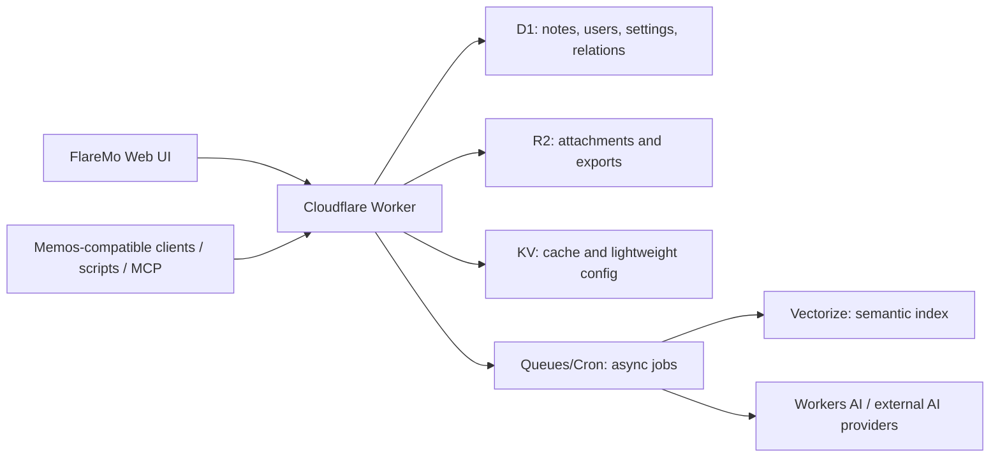

# FlareMo

**A Memos-compatible, Cloudflare-native personal knowledge management system.**

FlareMo is an open-source note and personal knowledge management project. The
goal is simple: keep the quick-capture spirit of Flomo, reuse as much of the
Memos ecosystem as possible, and make the whole stack deployable on Cloudflare.

> Status: early architecture and implementation stage. Star the repo if you
> want a Memos-compatible note system that can run fully on Cloudflare.

## What FlareMo Is

FlareMo is designed around three decisions:

1. **Memos-compatible first**
   - Memos-style data model: memos, users, attachments, relations, shares,
     settings, tags, and computed memo properties.
   - Memos-style resource names such as `memos/{id}`, `users/{id}`, and
     `attachments/{id}`.
   - A high-value `/api/v1` compatibility layer for Memos clients, scripts,
     import/export flows, OpenAPI, and MCP.

2. **Cloudflare-native runtime**
   - Workers for API and edge runtime.
   - D1 for relational data.
   - R2 for attachments, exports, generated assets, and audio.
   - Queues/Cron for background jobs.
   - Vectorize and Workers AI for future semantic search and AI workflows.

3. **Flomo-like product experience**
   - Capture-first writing.
   - A calm timeline for reviewing thoughts.
   - Fast search, tags, backlinks, and daily review.
   - Lightweight personal knowledge management instead of a heavy admin system.

## Why

Memos has the strongest open-source ecosystem in this space. It has a mature
data model, API direction, OpenAPI work, import/export value, and a large user
base.

Cloudflare has the right primitives for a lightweight personal knowledge system:
global Workers, serverless SQLite through D1, object storage through R2, and AI
building blocks at the edge.

FlareMo connects the two:

**Memos ecosystem compatibility + Cloudflare-native deployment + Flomo-style
capture experience.**

## Relationship With Memos

FlareMo is not trying to run the original Go Memos server unchanged on
Cloudflare. That server depends on a traditional long-running runtime:
`http.Server`, Echo, `database/sql`, SQLite/Postgres/MySQL drivers, filesystem
file serving, SSE connection management, and background runners.

FlareMo takes Memos as the primary specification and ecosystem anchor, then
rebuilds the runtime for Cloudflare:

- Keep the compatible data shape and public protocol where it matters.
- Reimplement storage on D1 and R2.
- Keep a Memos-compatible `/api/v1` surface for ecosystem reuse.
- Add FlareMo-native APIs only where the frontend needs a simpler edge-first
  shape.

## Planned Compatibility

The first compatibility target is a practical Memos subset, not full parity on
day one.

### Data Compatibility

- Memos-like memo/user/attachment/relation/share/settings tables.
- Compatible resource naming.
- Compatible memo payload/property shape for tags, title, links, tasks, code,
  and location.
- Memos import/export path.

### API Compatibility

Planned high-value endpoints:

- `POST /api/v1/memos`
- `GET /api/v1/memos`
- `GET /api/v1/{name=memos/*}`
- `PATCH /api/v1/{memo.name=memos/*}`
- `DELETE /api/v1/{name=memos/*}`
- `GET /api/v1/{name=memos/*}/attachments`
- `PATCH /api/v1/{name=memos/*}/attachments`
- `GET /api/v1/{name=memos/*}/relations`
- `PATCH /api/v1/{name=memos/*}/relations`
- `POST /api/v1/{parent=memos/*}/shares`
- `GET /api/v1/shares/{share_id}`
- `POST /api/v1/attachments`
- `GET /api/v1/attachments`
- `GET /api/v1/{name=attachments/*}`
- `DELETE /api/v1/{name=attachments/*}`

### Ecosystem Compatibility

- Bearer token / personal access token support for scripts and tools.
- OpenAPI document for the supported `/api/v1` subset.
- MCP endpoint generated from or aligned with that OpenAPI surface.

## Architecture

## Roadmap

- [ ] Cloudflare Worker + Vite app scaffold
- [ ] D1 migrations for Memos-compatible core schema
- [ ] Domain service layer for memos, users, attachments, relations, shares,
      settings, and tokens
- [ ] Memos-compatible `/api/v1` memo endpoints
- [ ] Flomo-like capture and timeline UI
- [ ] Import/export for Memos data
- [ ] R2 attachment storage
- [ ] OpenAPI for the supported compatibility subset
- [ ] MCP endpoint
- [ ] Semantic search with Vectorize
- [ ] AI review, related notes, and ask-your-notes workflows

## Reference Projects

FlareMo learns from:

- [usememos/memos](https://github.com/usememos/memos): primary ecosystem,
  model, and API reference.
- [blinkospace/blinko](https://github.com/blinkospace/blinko): AI search,
  attachments, references, and editor interaction reference.
- [XuYouo/MeowNocode](https://github.com/XuYouo/MeowNocode): lightweight
  Cloudflare D1 note-app reference.

## Contributing

The project is early. Useful contributions right now:

- Memos API compatibility research.
- D1 schema design.
- Cloudflare Worker implementation.
- Import/export compatibility tests.
- Product and UI direction for a Flomo-like writing flow.

Open an issue or discussion with concrete compatibility targets, API examples,
or Cloudflare implementation ideas.

## License

MIT
