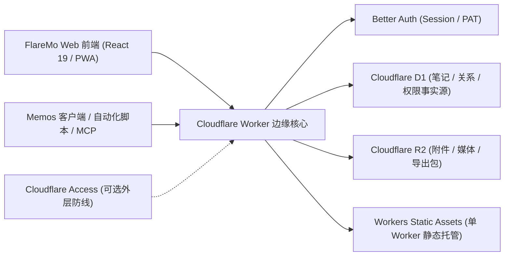

# FlareMo 🔥

<p align="center">
  <b>0 服务器 · 0 维护成本 · 24 小时全球边缘在线 · 数据绝对自主掌控</b><br>
  一个人用，是安静专注的私人灵感速记与第二大脑；一个团队用，是具备多级权限的共享知识库。
</p>

<p align="center">
  <a href="./README.md">English</a> •
  <a href="./README.zh-CN.md"><b>简体中文</b></a> •
  <a href="./README.ja.md">日本語</a> •
  <a href="./README.fr.md">Français</a> •
  <a href="./README.es.md">Español</a> •
  <a href="./README.ko.md">한국어</a> •
  <a href="./README.ru.md">Русский</a> •
  <a href="./README.ar.md">العربية</a>
</p>

<p align="center">
  <a href="https://github.com/realchendahuang/FlareMo/stargazers"></a>
  <a href="./LICENSE"></a>
  <a href="https://workers.cloudflare.com/"></a>
  <a href="https://github.com/usememos/memos"></a>
  <a href="https://www.better-auth.com/"></a>
  <a href="https://flaremo.app"></a>
</p>

<div align="center">

| ☀️ 桌面端 · 浅色明亮 | 🌙 桌面端 · 深色沉浸 | 📱 移动端 · 极简随行 |
| :---: | :---: | :---: |
|  |  |  |

<sub>真实运行界面：支持深浅主题无缝切换与全功能移动端自适应。所有展示功能均已稳定接入后端，不放未实现的占位按钮。</sub>

</div>

---

## 💡 为什么选择 FlareMo

Flomo 和 Memos 证明了「快速捕捉 + 流式时间线」这种无压力记录体验的巨大价值。但自部署传统的笔记系统通常意味着：你需要一台按月付费的 VPS、安装并配置 Docker / Postgres、编写定时备份脚本，还要时刻提防硬盘损坏或机房故障导致的数据损失。

FlareMo 探索了一条完全不同的道路：**仅凭一个免费的 Cloudflare 账号，不买服务器、不装数据库、不写备份脚本，就能拥有一个 24 小时高可用、数据永不丢失、全球就近加速、还能被各类 AI 与自动化工具调用的现代化知识库。**

- **真正的 Serverless**：代码与静态前端直接部署在 Cloudflare Workers 全球边缘网络，毫秒级响应。
- **开箱即用的企业级存储**：以 Cloudflare D1 作为元数据与笔记事实源，Cloudflare R2 存储媒体附件，自带跨地域持久化冗余。
- **AI 原生设计**：内置 MCP 协议与 Agent Memory 长期记忆中枢，让 AI 真正成为你的第二大脑。
- **一人安静，多人协同**：默认是私密的单人速记空间；开启团队模式后，即刻变身为具备精细角色与可见性隔离的团队工作台。

---

## ✨ 核心特性

### 1. 极速速记与沉浸式回顾
- **即开即写**：卡片式流式时间线，支持多标签归类、Markdown/GFM 渲染、图片与音频媒体预览。
- **智能搜索**：D1 FTS5 全文快速检索，支持过滤条件（`has:attachment`、`is:pinned`、`before:YYYY-MM-DD`、`after:YYYY-MM-DD`、`in:timeline|archive|trash`）。
- **向量语义「找一找」**：集成 Cloudflare Workers AI embedding + Vectorize 派生索引，理解上下文意图；自动鉴权并在索引未就绪时平滑降级为关键词搜索。
- **灵感激活**：内置**每日回顾**（那年今日时光机）、**随机漫步**（标签与双向链接穿梭游走 + 明信片总结）和 memo 详情页相关笔记推荐。
- **版本回溯**：完整的修改历史与版本对比，随时还原任一历史快照。

### 2. AI 长期记忆与 MCP 原生集成
- **Agent Memory**：通过 `/memory/mcp` 端点，AI Agent（Claude Desktop、Cursor、Codex、OpenAI 等）可以直接读写跨会话的长期记忆（偏好、决策、约束、教训）。
- **人机协同**：用户可在 `/memory` 界面集中查看、确认、锁定或纠正 AI 沉淀的记忆，确保知识沉淀准确可控。
- **生态互联**：提供标准 `/mcp` 端点（Streamable HTTP MCP），支持快速查询笔记与灵感沉淀。

### 3. 团队协作与三级权限体系
- **角色清晰**：提供 `owner` / `admin` / `member` 三种角色体系。管理员签发一次性激活链接，成员自主设置密码，保障隐私合规。
- **三档可见性**：
  - 🔒 **私密**：仅作者本人可见。
  - 👥 **团队可见**：团队有效成员只读共享。
  - 🌐 **全网公开**：匿名只读分享（带有时效控制与状态校验）。
- **安全移除与物理清理**：成员被移出空间时，自动触发可重试的私有数据深度清理，团队与公开沉淀妥善保留。

### 4. 离线可用与多端适配（PWA）
- **可安装 PWA**：支持一键安装到桌面和手机主屏幕，原生 App 级流畅体验。
- **离线可靠写入**：断网状态下草稿本地暂存，离线提交（含图片/附件）进入待同步队列，恢复网络后自动按序安全提交。
- **实时语音速记**：登录后访问 `/capture` 页面，支持前台实时流式 ASR 语音听写转文本，随想随录。

### 5. 坚固的应用层认证
- **Better Auth 驱动**：浏览器使用安全 `HttpOnly`、`SameSite=Lax` Cookie Session；脚本、MCP 和第三方客户端使用账户签发的可撤销 `memos_pat_` Personal Access Token。
- **严密防御**：状态变更请求（POST/PATCH/DELETE）强制精确校验 Origin 白名单；支持 Cloudflare Access 作为可选外层防护。

### 6. Memos 兼容与无痛迁移
- **兼容 Memos API**：提供 `/api/v1/*` 核心端点（camelCase 与 legacy snake_case 支持）与 OpenAPI 契约规范。
- **适配主流客户端**：兼容 Moe Memos 等主流第三方客户端及周边自动化工具。
- **双向无损导入导出**：支持 Memos 标准格式数据包一键导入（带冲突处理策略）与全量归档导出。

---

## 📊 免费额度到底够用多少？

很多人对 Cloudflare 免费计划的容量缺乏概念，实际上对于个人或小团队知识库场景，免费配额几乎是**永久溢出**的：

| 资源组件 | 免费配额 | 对应知识库容量 | 实际使用评估 |
| :--- | :--- | :--- | :--- |
| **Cloudflare D1** | **5 GB 数据库** | 约 **250 万条** 纯文本笔记 | 即使每天坚持记录 100 条，也能连续记录 **68 年** |
| **Cloudflare R2** | **10 GB 对象存储** | 约 **5,000–10,000 张** 高清压缩图片 / **80 小时** 语音 | **0 出口流量费用**，公开分享大量图片也无需担忧账单 |
| **Cloudflare Workers** | 免费边缘请求额度 | 全球 300+ 边缘节点就近响应 | 首字节毫秒级响应，告别服务器延迟与卡顿 |

> 换言之，在绝大多数使用周期内，你都不需要为服务器、存储或流量支付一分钱。

---

## 🥊 架构对比：Cloudflare 原生 vs 家用 NAS vs 传统 VPS

| 评估维度 | Cloudflare 原生架构 (FlareMo) | 家用 NAS / 软路由自建 | 传统 VPS 云主机 |
| :--- | :--- | :--- | :--- |
| **数据安全性** | **企业级多副本持久化**，无单点硬件故障风险 | 硬盘损坏、断电、漏水可能导致全量数据损失 | 依赖自行配置的备份策略与快照 |
| **日常维护成本** | **零维护**：无需打补丁、无系统升级、无 Docker 运维 | 需维护系统、Docker、监控硬盘 SMART、维护网络 | 需定期升级操作系统内核、数据库、配置看门狗 |
| **外网访问速度** | **全球边缘 CDN 加速**，就近节点直接命中 | 需自行配置内网穿透（frp/Tailscale），受家庭上行带宽限制 | 取决于单个机房地理位置，跨地域访问延迟高 |
| **网络与证书** | **自带免费 HTTPS 与自定义域名绑定**，自动续签 | 需自行申请泛域名证书、配置 DDNS 与反向代理 | 需配置 Nginx/Caddy 及 Let's Encrypt 证书轮换 |
| **资金支出** | **0 元**（利用长期免费额度） | 硬件购置成本高昂（数千元），且有电费开销 | 按月/年持续支付服务器与带宽续费账单 |

---

## 🚀 5 分钟极速部署

FlareMo 刻意保持轻巧。部署流程完全透明，可由 AI Agent 代劳，亦可手动通过 CLI 执行。

### 方式一：让 AI Agent 替你部署（推荐）

仓库内附带专为 AI 编写的部署指引：[docs/agent-deploy.md](./docs/agent-deploy.md)。

只需将本项目仓库路径提供给能够执行终端命令的 AI Agent（如 Claude Code、Cursor Agent、Codex），对它说：
> “请按照 docs/agent-deploy.md 的指引帮我部署 FlareMo 到我的 Cloudflare 账号。”

Agent 将自动完成创建 D1/R2 资源、写入配置、运行数据库迁移与发布全部流程。

---

### 方式二：GitHub Action 手动部署

自己的 fork 可在 Actions 里手动运行 `Deploy to Cloudflare`：创建 Cloudflare 资源、发布 Worker、同步认证密钥。push 不会自动发布。步骤见 [GitHub Action 部署教程](./docs/github-action-deploy.md)。

---

### 方式三：手动 3 步部署

#### 1. 创建 Cloudflare 存储资源
```bash
# 登录 Cloudflare 账号
pnpm exec wrangler whoami

# 创建 D1 数据库与 R2 存储桶
pnpm exec wrangler d1 create flaremo
pnpm exec wrangler r2 bucket create flaremo-attachments
```

#### 2. 初始化配置文件与安全密钥
复制配置模板：
```bash
cp wrangler.jsonc.example wrangler.jsonc
```
在 `wrangler.jsonc` 中填入第一步终端输出的 `database_id`，并将 `FLAREMO_PUBLIC_URL` 设置为你的生产访问域名（如 `https://notes.yourdomain.com`）。

生成并安全写入必要密钥：
```bash
pnpm exec wrangler secret put BETTER_AUTH_SECRET --config ./wrangler.jsonc
pnpm exec wrangler secret put FLAREMO_BOOTSTRAP_SECRET --config ./wrangler.jsonc
```

#### 3. 部署上线
```bash
# 验证构建与打包
pnpm verify
pnpm deploy:dry-run

# 执行远端数据库迁移并部署 Worker
pnpm deploy
```

部署完成后，在浏览器打开你的生产域名并访问 `/setup` 页面，输入你在部署时填写的 `FLAREMO_BOOTSTRAP_SECRET`，即可一键初始化拥有最高权限的 Owner 账号！

> 完整部署细节与常见问题排查请参见 [部署文档](./docs/deploy.md)。用 GitHub Action 手动发布请参见 [GitHub Action 部署教程](./docs/github-action-deploy.md)。后续版本升级请参见 [版本更新手册](./docs/update.md)。

---

## 🧱 架构与技术栈

### 系统拓扑


### 技术栈选型
- **边缘运行时**：Cloudflare Workers (V8 Isolate)
- **Web 前端**：React 19, Vite, TanStack Router (Code-based), Tailwind CSS 4, Radix UI
- **数据层**：Cloudflare D1 (SQLite at the edge), Drizzle ORM
- **存储层**：Cloudflare R2 (S3 兼容对象存储)
- **鉴权体系**：Better Auth 原生方案（HttpOnly Cookie + 可撤销 `memos_pat_`）
- **AI 与搜索**：Cloudflare Workers AI, Vectorize 向量检索, SQLite FTS5 全文搜索

---

## 🤝 Memos 生态与兼容说明

FlareMo 的初心是构建 **AI Native 的新一代个人与团队知识中枢**。我们以 Memos 优秀的领域设计与 API 契约为生态底座，但**不以 100% 盲目复刻上游为目标**：

- **深度复用**：完整兼容 `/api/v1` 核心端点、OpenAPI 契约以及数据导入导出，使现有的 Memos 移动端 App（如 iOS / Android 客户端）及快捷指令可以直接连接使用。
- **原生演进**：Agent Memory 长期记忆体系、向量语义「找一找」、三档团队权限模型、流式语音转录均为 FlareMo 原生能力，不受上游架构束缚。

API 兼容细节见 [兼容矩阵](./docs/memos-compatibility.md)，第三方工具实测记录见 [生态实测矩阵](./docs/memos-ecosystem.md)。

---

## 🛠️ 本地开发与工程验证

```bash
# 安装依赖
pnpm install

# 初始化本地 D1 数据库
pnpm migrate:local

# 启动本地开发服务 (默认 http://localhost:8787)
pnpm dev
```

### 质量门禁与测试规范

```bash
# 代码风格与静态检查
pnpm format:check
pnpm check

# 单元测试与契约测试
pnpm test

# 生产发版前综合质检（完整门禁）
pnpm verify
```

---

## 🌟 Star History

如果你觉得 FlareMo 对你有帮助，欢迎点亮右上角的 Star ⭐️，你的支持是项目持续迭代的最大动力！

<p align="center">
  <a href="https://star-history.com/#realchendahuang/FlareMo&Date">
    
  </a>
</p>

---

## 📄 开源许可证

本项目基于 [GNU AGPL-3.0](./LICENSE) 协议开源。
- 允许自托管部署、修改和学习使用。若基于本项目以网络服务（SaaS）形式对外提供修改版本，须按 AGPL-3.0 条款向用户开源修改后的全部源代码。
- Copyright (c) 2026 realchendahuang.
